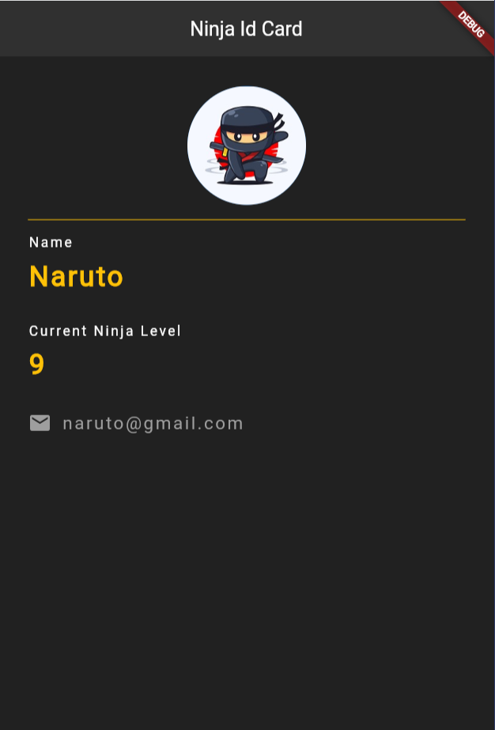

# Ninja Id App Using Flutter

  

## Table of Contents

- [About the Project](#about-the-project)
  - [Project Overview](#project-overview)
  - [Key Features](#key-features)
- [Getting Started](#getting-started)
  - [Usage](#usage)
- [Contributing](#contributing)
- [License](#license)
- [Contact](#contact)

## About the Project

### Project Overview

The ID Card App is a simple and intuitive application that generates virtual ID cards. It displays a user's picture, name, and email address in a clear and organized manner. The purpose of this app is to provide a user-friendly solution for quickly creating and viewing ID cards.

### Key Features

- **Picture Display:** The app prominently showcases the user's picture, making the ID card visually appealing.
- **Name Display:** The user's name is displayed prominently on the card, ensuring easy identification.
- **Email Address:** The email address associated with the user is included, providing a reliable contact method.

## Getting Started

### Prerequisites

- Dart Langage basic
- Widgets Understanding

### Usage

1. You can use this project to learn simple UI making for Id card in flutter.

## Contributing

We welcome contributions to enhance the ID Card App. If you have ideas for improvements, new features, or bug fixes, feel free to contribute.

## License

No License

## Contact

For any questions or inquiries, please contact us at [yashd7327@gmail.com](mailto:yashh7327@gmail.com) or connect with us on Twitter [@yaranathakur](https://twitter.com/yaranathakur).

---
